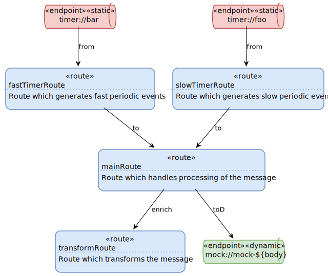

## Overview
camel-plantuml is a tool which helps to generate [PlantUML](https://plantuml.com/) activity diagrams which describe Apache [Camel](https://camel.apache.org/) routes, based on an actual **running** Camel context. 

It allows to have diagrams where you can see interactions between endpoints and routes.

If you consider following routes:
```
from(timer("foo").period(5000)).id("slowTimerRoute")
        .description("Route which generates slow periodic events")
        .setBody(constant("slow"))
        .to(seda("endpoint1"));

from(timer("bar").period(1000)).id("fastTimerRoute")
        .description("Route which generates fast periodic events")
        .setBody(constant("fast"))
        .to(seda("endpoint1"));

from(seda("endpoint1")).id("mainRoute")
        .description("Route which handles processing of the message")
        .log(LoggingLevel.INFO, "${body}")
        .enrich().constant("direct://endpoint2")
        .toD(mock("mock-${body}"));

from(direct("endpoint2")).id("transformRoute")
        .description("Route which transforms the message")
        .transform(simple("${body}${body}"));
```
It will allow you to generate these images:

- with all endpoints:


- without the "internal" endpoints:



This tool is intended to be a software documentation tool, it is not intended to be a monitoring tool with real-time metrics or statistics.

## How it works
This tool needs to have access to a running Camel context instance.
It uses the Camel JMX MBeans (which are enabled by default in Camel), and particularly the ones related to routes and processors. Therefore, this tool does NOT work during design time or coding of the Camel routes. It requires an actual running Camel context.

Following processors are handled:
- SendProcessor (`to`)
- SendDynamicProcessor (`toD`)
- Enricher (`enrich`)
- PollEnricher (`pollEnrich`)
- WireTapProcessor (`wireTap`)
- RecipientList (`recipientList`)

It parses the processors to extract URI(s) information. 
If an expression is found, then, based on the language of the expression:
1. If the language is `constant`, it will consider it as a static endpoint (which could be used in other processors or routes).
2. If the language is `simple`, it will consider it as a dynamic endpoint (with no possible link with other processors or routes).
3. Otherwise, it will ignore the endpoint.

The PlantUML code is exposed through a configurable HTTP endpoint, so it can be re-worked, and finally rendered as an image.

## Features
This tool generates PlantUML diagrams with following features:
- each route is rendered as a rectangle, with its id and description
- each static endpoint base URI is rendered as a queue with a "static" layout.
- each dynamic endpoint URI is rendered as a queue with a "dynamic" layout.
- each consumer is rendered as a labelled arrow (`from` or `pollEnrich`) which connects an endpoint to a route.
- each producer is rendered as a labelled arrow (`to`,`toD`,`enrich`,`wireTap` or `recipientList`) which connects a route to an endpoint.
- it is possible to connect the routes to each other, if you don't want to display the "internal" endpoints on the diagram. Routes have to share a `direct` or `seda` endpoint.


## How to use ?
This tool can be used in two different ways:
 - _**embedded**_ mode: the tool is embedded to your application (suggested mode).
 - _**remote**_ mode: the tool connects to your application through an unsecured JMX url.

### Option 1: _embedded_ mode
In this mode, the tool is embedded within your project and connects directly to the MBean server of your application's JVM.
The tool exposes the UML diagram directly from your application through a dedicated HTTP endpoint.

#### 1. Add the dependency to your project:
The jar is a OSGi bundle, hence it can be used with Apache ServiceMix/Apache Karaf.

If you use Camel **2.x**:
```
<dependency>
    <groupId>io.github.ncasaux</groupId>
    <artifactId>camel2-plantuml-jar</artifactId>
    <version>1.2.1</version>
</dependency>
```
If you use Camel **3.x**:
```
<dependency>
    <groupId>io.github.ncasaux</groupId>
    <artifactId>camel3-plantuml-jar</artifactId>
    <version>1.2.1</version>
</dependency>
```

#### 2. Add the route builder to your Camel context:
`getContext().addRoutes(new CamelPlantUmlRouteBuilder());`

Default host is `localhost`, default port is `8090`, but you can overide them:

`getContext().addRoutes(new CamelPlantUmlRouteBuilder("localhost", 8090));`

#### 3. Start your Camel context, and open a browser:
To have all the endpoints, go to:

`http://localhost:8090/camel-plantuml/diagram.puml`

To connect routes directly (and hide "internal" endpoints), add the following parameter:

`http://localhost:8090/camel-plantuml/diagram.puml?connectRoutes=true`

### Option 2: _remote_ mode
In this mode, the tool connects remotely to the MBean server of your application's JVM.
The tool exposes the UML diagram directly from its dedicated HTTP endpoint.
The tool is packaged as a zip file.

#### 1. Download the zip file:
Download the latest release from [here](https://github.com/ncasaux/camel-plantuml/releases/download/camel3-plantuml-v1.2.1/camel3-plantuml-zip-1.2.1.zip)

Unzip it in the folder of your choice and go into this folder.

#### 2. Enable JMX unsecure connection in your application
Start **your application** with following parameters and port of your choice:
```
-Dcom.sun.management.jmxremote.authenticate=false
-Dcom.sun.management.jmxremote.ssl=false
-Dcom.sun.management.jmxremote.port={{JMX_PORT}}
-Djava.rmi.server.hostname={{YOUR_APPLICATION_IP}}
```

#### 3. Connect the tool to your application
Start locally the tool with parameter `jmxHost`:

`java -DjmxHost={{YOUR_APPLICATION_IP}}:{{JMX_PORT}} -jar camel3-plantuml-zip-1.2.1.jar`

#### 4. Open a browser:
To have all the endpoints, go to:

`http://localhost:8090/camel-plantuml/diagram.puml`

To connect routes directly (and hide "internal" endpoints), add the following parameter:

`http://localhost:8090/camel-plantuml/diagram.puml?connectRoutes=true`

## Rendering the PlantUML Code
There are multiple options:
- You can install PlantUML extension on your IDE, and graphviz on your computer to render locally (the best option).
- You can use a web browser extension to directly render the code. There are extensions for Chrome and Firefox.
- You can use the official PlantUML [webserver](http://www.plantuml.com/plantuml/uml "PlantUML webserver") and copy/paste the diagram.

## FAQ
1. What are the differences with the [Camel plugin for hawtio](http://hawtio.github.io/hawtio/plugins/camel/) ?

The Camel plugin for hawtio has also a graphical representation of routes and route steps. 
However, there is no graphical connection between routes directly, as each route is drawn individually.
So you can not know the routes/endpoints interconnections.
That is the main purpose of this tool.

2. Why this tool can not expose directly the images of the diagrams, instead (or along with) the PlantUML code?

This tool is based on [legacy PlantUML activity diagrams](https://plantuml.com/en/activity-diagram-legacy)
To draw such diagrams, Graphviz is required, and unfortunately, there is no Java implementation of Graphviz...

3. So, why don't this tool use the [new PlantUML activity diagrams](https://plantuml.com/en/activity-diagram-beta),
which do not require Graphviz anymore ?

As far as I know, the new activity diagram is not intended to create connections between any two actions,
and that's completely incompatible with diagrams this tool aims to create.

## Contributing
Any suggestion, remark, or question? Feel free to create an issue and/or to contribute by forking and making pull requests!

## Releases notes
### v1.2.1
- Renamed groupId and packages to io.github.ncasaux
- Changed to latest LTS Camel3 version (3.11) and latest Camel2 version (2.25.4)
- Updated POM to be able to publish to Maven Central
- Updated dependencies version
- Removed unused dependencies
### v1.1.1
- Fixed that internal endpoints must be with scheme `direct` or `seda` to connect routes when using parameter `connectRoutes=true`
- Fixed zip maven assembly and updated maven plugins versions
### v1.1.0
- Added a remote mode to use the tool, which allows connection to an existing JMX MBean server
- Added some tips in the .puml generated file to help layout tweaking
- Display labels of producer AND consumer on arrows when using parameter `connectRoutes=true`
- Route without description are now shown as is.
### v1.0.0
- Initial version
